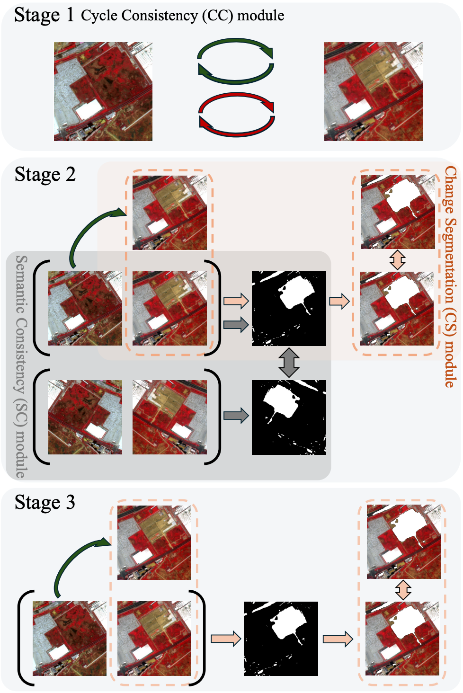
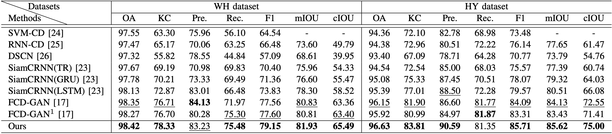

# CCDF: Consistency Change Detection Framework for Unsupervised Remote Sensing Change Detection

This is the official implementation of "Consistency Change Detection Framework for Unsupervised Remote Sensing Change Detection".

Unsupervised remote sensing change detection aims to monitor and analyze changes from multi-temporal remote sensing images in the same geometric region at different times, without the need for labeled training data. Previous unsupervised methods attempt to achieve style transfer across multi-temporal remote sensing images through reconstruction by a generator network, and then capture the unreconstructable areas as the changed regions. However, it often leads to poor performance due to generator overfitting. In this paper, we propose a novel Consistency Change Detection Framework (CCDF) to address this challenge. Specifically, we introduce a Cycle Consistency (CC) module to reduce the overfitting issues in the generator-based reconstruction. Additionally, we propose a Semantic Consistency (SC) module to enable detail reconstruction. Extensive experiments demonstrate that our method outperforms other state-of-the-art approaches.

### CCDF architecture

our Consistency Change Detection Framework (CCDF) is trained in three stages. In the first stage, we leverage generative networks to achieve global style transfer and reconstruction of the bi-temporal remote sensing images. In this stage, we introduce a Cycle Consistency (CC) module to decouple the content and style information, enabling robust reconstruction across time points. The second stage focuses on learning a segmentation network to capture the regions that cannot be effectively transferred by the generative models. We apply a Change Segmentation (CS) module to capture the unreconstructed regions. Besides, we propose a Semantic Consistency (SC) module to emphasize the reconstruction of details, leading to more accurate segmentation of the changed areas. Finally, in the third stage, we alternate the fine-tuning of the generative network and the segmentation network, further boosting the overall performance of our change detection framework.
 

## Usage

Clone this project:

    git clone https://github.com/cherry0116/CCDF.git

We train the model on the following environments:

    Python 3.9
    Pytorch 2.0.0
    Torchvision 0.15.1
    Torchaudio 2.0.1
    Cuda 11.8

You can go to the install directory and build the environment quickly by installing the requirements:

    cd install_folder
    conda env create -f ccdf.yaml
    conda activate ccdf
    pip install -r ccdf.txt

We then go to the code directory and train the CCDF model:
    
    cd ../changedet_code
    CUDA_VISIBLE_DEVICES=0 python Demo_USSS.py

### Performance

## Contact

If you have any question about this project, please feel free to contact liuyat@mail.ustc.edu.cn.
